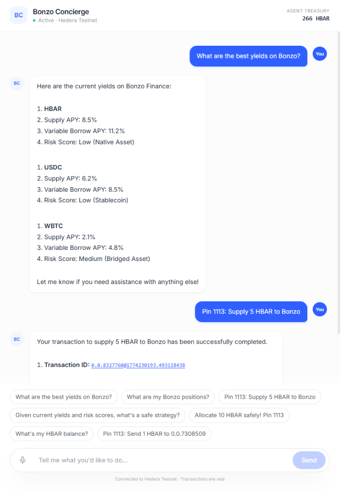

# Bonzo Concierge

A voice and text DeFi agent built on Hedera. Users describe an intent in plain language; the agent evaluates the Bonzo Finance market, makes a risk-adjusted decision, and executes on-chain. Every transaction produces a HashScan receipt.

**[Live Demo](https://bonzo-concierge.vercel.app/)** | **[Demo Video](https://www.youtube.com/watch?v=EfWChKsFjTI)** | **[Pitch Deck (PDF)](Bonzo_Concierge_AI.pdf)**

---

## Architecture

The frontend is a Next.js chat interface with optional ElevenLabs TTS. An OpenAI intent router dispatches to typed tool calls implemented with `@hashgraph/sdk` and the Hedera Agent Kit. The agent operates a treasury account (`0.0.8327760`) and signs all transactions server-side.

Six tools are available in the chat:

| Tool | What it does |
|---|---|
| `check_balance` | Query HBAR balance via Mirror Node |
| `get_bonzo_apys` | Fetch live Bonzo supply/borrow rates |
| `check_bonzo_position` | Read the user's Bonzo lending positions |
| `supply_to_bonzo` | Transfer HBAR to Bonzo vault; logs the action to HCS via `coreConsensusPlugin` |
| `transfer_hbar` | Send HBAR to any account |
| `schedule_harvest` | Create a native `ScheduleCreateTransaction` via `coreAccountPlugin` with `schedulingParams.isScheduled=true` |

`supply_to_bonzo` fires a `submit_topic_message_tool` call after each successful transfer, writing a structured JSON audit record to an HCS topic. `schedule_harvest` produces a real Hedera schedule entity (co-signable, no external keeper) and returns the Schedule ID.




---

## Why Hedera

Hedera's properties directly affect what an autonomous agent can do safely:

- Transactions are ordered by timestamp, not fee. There is no mempool to exploit.
- Finality is deterministic in 3-5 seconds.
- Fees are fixed at fractions of a cent, making micro-transactions economically viable.
- Scheduling, consensus messaging, and token creation are native L1 operations exposed directly by the Hedera Agent Kit.

---

## Demo scripts

Four standalone scripts that prove each layer of the stack works on live testnet. All use the Hedera Agent Kit. The Bonzo WETHGateway is paused on testnet, so the keeper script falls back to a direct vault transfer and catches the expected contract revert for audit purposes.

---

### `demo_intelligent_keeper.ts`

**`npx tsx scripts/demo_intelligent_keeper.ts`**

Runs the full keeper lifecycle:

1. Creates a new user account via the Agent Kit `create_account_tool` (ECDSA keypair, EVM address, funded with 0.1 HBAR from treasury).
2. Fetches live Bonzo market data. Falls back to the Hedera Mirror Node when Cloudflare blocks the server-side request.
3. Fires 5 concurrent HBAR transfers via `Promise.all` to demonstrate that a Hedera agent treasury can fan out transactions simultaneously. On Ethereum, a single wallet can only hold one pending transaction at a time.
4. Constructs and broadcasts a real Aave V2 `depositETH` payload to the Bonzo WETHGateway (`0xA824...`). The contract reverts because the testnet pool is paused, but the attempt is finalized on-chain and verifiable on HashScan.

New account: `0.0.8338130` | [HashScan](https://hashscan.io/testnet/transaction/0.0.8327760-1774232386-404472137)

[Full output](docs/sample-output/demo_intelligent_keeper.md)

---

### `demo_multi_agent_hcs.ts`

**`npx tsx scripts/demo_multi_agent_hcs.ts`**

Demonstrates multi-agent coordination using the Hedera Consensus Service via [`coreConsensusPlugin`](https://github.com/hedera-dev/hedera-agent-kit).

1. Creates a shared HCS topic with `create_topic_tool`.
2. `Trader_Agent` submits a Bonzo supply proposal via `submit_topic_message_tool`.
3. `Risk_Agent` submits an approval referencing sequence #1.
4. Mirror Node confirms both messages in consensus order within seconds.

The result is an immutable, publicly readable audit trail at a fixed topic address. No centralized broker involved.

Topic: `0.0.8338020` | [HashScan](https://hashscan.io/testnet/topic/0.0.8338020)

[Full output](docs/sample-output/demo_multi_agent_hcs.md)

---

### `demo_scheduled_harvest.ts`

**`npx tsx scripts/demo_scheduled_harvest.ts`**

Uses the Agent Kit's `coreAccountPlugin` `transfer_hbar_tool` with `schedulingParams: { isScheduled: true }`. This wraps the transfer in a `ScheduleCreateTransaction`, committing the intent to the hashgraph without executing it immediately.

On Ethereum, scheduling a future transaction requires an external keeper network (Gelato, Chainlink Automation, Keep3r). Hedera does this natively. The schedule is co-signable, auditable, and requires no external infrastructure.

Schedule: `0.0.8338115` | [HashScan](https://hashscan.io/testnet/schedule/0.0.8338115)

[Full output](docs/sample-output/demo_scheduled_harvest.md)

---

### `demo_hts_loyalty_token.ts`

**`npx tsx scripts/demo_hts_loyalty_token.ts`**

Mints "Bonzo Concierge Points" (BCP) as a native Hedera Token Service fungible token using `coreTokenPlugin` `create_fungible_token_tool`. No Solidity or contract deployment required.

The token is EVM-compatible and accessible as an ERC-20 at its contract address. Transfer cost is ~$0.001. In production the agent distributes BCP to users after each keeper action via `airdrop_fungible_token_tool`, logged to HCS for accounting.

Token: `0.0.8338014` | [HashScan](https://hashscan.io/testnet/token/0.0.8338014)

[Full output](docs/sample-output/demo_hts_loyalty_token.md)

---

## Setup

```bash
git clone https://github.com/vjb/bonzo-concierge
cd bonzo-concierge
cp .env.example .env
npm install
npm run dev
```

Required environment variables:

```
HEDERA_ACCOUNT_ID=
HEDERA_PRIVATE_KEY=
HEDERA_NETWORK=testnet
HEDERA_RPC_URL=https://testnet.hashio.io/api
OPENAI_API_KEY=
ELEVEN_LABS_KEY=
```

---

## Stack

| Layer | Technology |
|---|---|
| Chat UI | Next.js, Vercel AI SDK, OpenAI GPT-4o-mini |
| Agent runtime | Hedera Agent Kit v3 |
| Network | Hedera Testnet (`@hashgraph/sdk`) |
| Protocol | Bonzo Finance (Aave V2 on Hedera) |
| Voice | ElevenLabs TTS |
| Verification | Hedera Mirror Node, HashScan |
